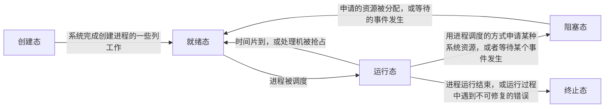

+ 创建态：进程被创建时，OS为其分配资源，初始化PCB
+ 就绪态：进程已经具备运行条件，但是没有空闲CPU，暂时无法运行
+ 运行态：一个进程此时正在CPU上运行
+ 阻塞态：请求等待某个事件的发生（资源分配、其他进程响应）
+ 终止态：请求操作系统终止该进程

进程PCB中，会有一个变量state来表示进程的当前状态。
对于同一个状态下的各个进程进行统一管理，OS会将各个进程的PCB组织起来

