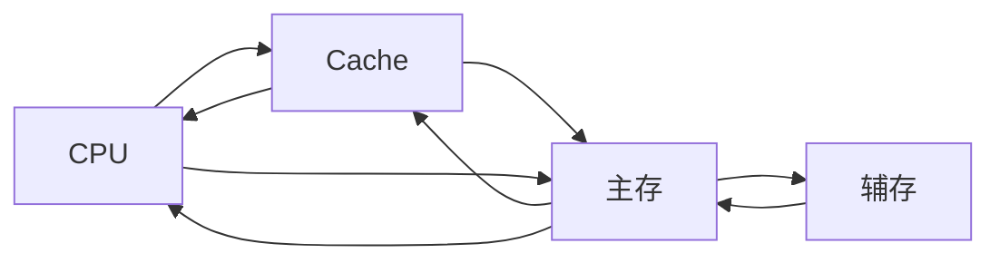

# 存储器的层次结构

+ Cache--主存层（硬件自动完成）：解决主存与CPU速度不匹配的问题
+ 主存--辅存层（硬件+操作系统（页面置换））：实现**虚拟存储系统**，解决主存容量不够的问题
+ 
# 存储器的分类

+ 层次分类：高速缓存（Cache）、主存储器（主存、内存）、辅助存储器（辅存、外存）
+ 存储介质：半导体存储器（主存、Cache）、磁表面存储器（磁带、磁盘、机械硬盘）、光存储器
+ 存取方式：随机存取存储器（RAM、内存条）、\[顺序存取存储器（SAM）、直接存取存储器（DAM）]\[串行访问存储器：读写某个存储单元所需时间与存储单元的物理位置有关]、相联存储器（CAM）:可以按照内容检索到存储位置进行读写，“快表”
+ 可更改性：读写存储器（磁盘、内存、Cache）、只读存储器（CD-ROM、蓝光光碟、BIOS）
+ 可保存性：易失性存储器（主存、Cache）、非易失性存储器（磁盘、光盘）、破坏性读出（DRAM芯片）、非破坏性读出（SRAM芯片、磁盘、光盘）

# 存储器的性能指标

1. 存储容量：存储字数\*字长
2. 单位成本：每位价格=总价格/总容量
3. 存储速度：数据传输率=数据宽度（存储字长）/存储周期
+ 存取时间（Ta）:启动一次存储器操作到完成该操作所经历的时间，分为读出时间和写入时间
+ 存取周期（Tm）:存取时间+恢复时间
+ 主存带宽（Bm）:数据传输率，每秒从主存进入信息的最大数量